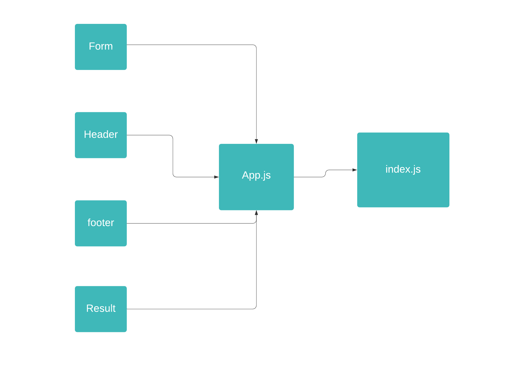

# LAB - Component Based UI

## Author:Alaa Abu Issa

### How to use this application:
- clone the repository in your terminal.
- navigate your way to the directory.
- install all dependecies npm i
- after installation run this command nopm start to start the application.

## PULL REQ: 
## sandBox URL : 

### UML 
